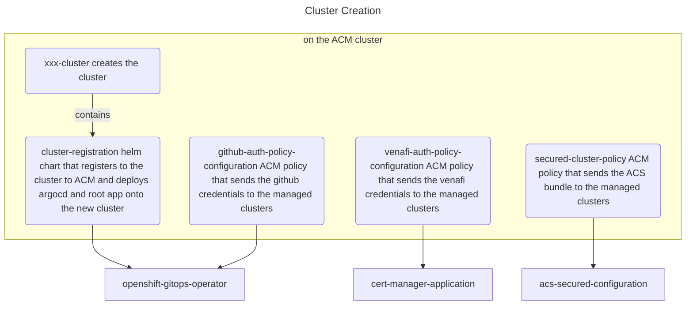

# Cluster Creation Dependencies

```mermaid
---
title: Cluster Creation
---
flowchart TD
    venafi-auth-policy-configuration --> cert-manager-application
    cluster-registration --> openshift-gitops-operator
    github-auth-policy-configuration --> openshift-gitops-operator
    secured-cluster-policy --> acs-secured-configuration

  subgraph "on the ACM cluster"
    xxx-cluster(xxx-cluster creates the cluster) -- contains --> cluster-registration(cluster-registration helm chart that registers to the cluster to ACM and deploys argocd and root app onto the new cluster)
    venafi-auth-policy-configuration(venafi-auth-policy-configuration ACM policy that sends the venafi credentials to the managed clusters)
    github-auth-policy-configuration(github-auth-policy-configuration ACM policy that sends the github credentials to the managed clusters)
    secured-cluster-policy(secured-cluster-policy ACM policy that sends the ACS bundle to the managed clusters)
  end


```