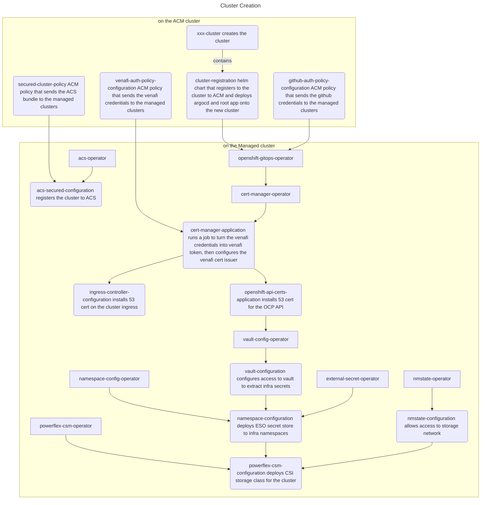

# Cluster Creation Dependencies

```mermaid
---
title: Cluster Creation
---
flowchart TD
    venafi-auth-policy-configuration --> cert-manager-application
    cluster-registration --> openshift-gitops-operator
    github-auth-policy-configuration --> openshift-gitops-operator
    secured-cluster-policy --> acs-secured-configuration

  subgraph "on the ACM cluster"
    xxx-cluster(xxx-cluster creates the cluster) -- contains --> cluster-registration(cluster-registration helm chart that registers to the cluster to ACM and deploys argocd and root app onto the new cluster)
    venafi-auth-policy-configuration(venafi-auth-policy-configuration ACM policy that sends the venafi credentials to the managed clusters)
    github-auth-policy-configuration(github-auth-policy-configuration ACM policy that sends the github credentials to the managed clusters)
    secured-cluster-policy(secured-cluster-policy ACM policy that sends the ACS bundle to the managed clusters)
  end

  subgraph "on the Managed cluster"
    openshift-gitops-operator --> cert-manager-operator
    cert-manager-operator --> cert-manager-application(cert-manager-application runs a job to turn the venafi credentials into venafi token, then configures the venafi cert issuer)
    cert-manager-application --> ingress-controller-configuration(ingress-controller-configuration installs 53 cert on the cluster ingress)
    cert-manager-application --> openshift-api-certs-application(openshift-api-certs-application installs 53 cert for the OCP API)
    openshift-api-certs-application --> vault-config-operator
    vault-config-operator --> vault-configuration(vault-configuration configures access to vault to extract infra secrets)
    nmstate-operator --> nmstate-configuration(nmstate-configuration allows access to storage network)
    namespace-config-operator --> namespace-configuration(namespace-configuration deploys ESO secret store to infra namespaces)
    vault-configuration --> namespace-configuration
    external-secret-operator --> namespace-configuration
    powerflex-csm-operator --> powerflex-csm-configuration(powerflex-csm-configuration deploys CSI storage class for the cluster)
    namespace-configuration --> powerflex-csm-configuration
    nmstate-configuration --> powerflex-csm-configuration
    acs-operator --> acs-secured-configuration(acs-secured-configuration registers the cluster to ACS) 
  end


```