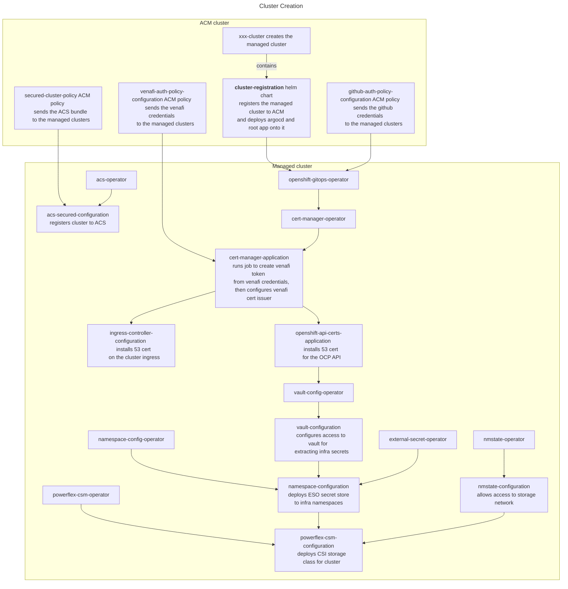

# Cluster Creation Dependencies

```mermaid
---
title: Cluster Creation
---
flowchart TD
    venafi-auth-policy-configuration --> cert-manager-application
    cluster-registration --> openshift-gitops-operator
    github-auth-policy-configuration --> openshift-gitops-operator
    secured-cluster-policy --> acs-secured-configuration

  subgraph "ACM cluster"
    xxx-cluster["xxx-cluster creates the managed cluster"] -- contains --> cluster-registration["<b>cluster-registration</b> helm chart
registers the managed cluster to ACM
and deploys argocd and root app onto it"]
    venafi-auth-policy-configuration["venafi-auth-policy-configuration ACM policy 
    sends the venafi credentials 
    to the managed clusters"]
    github-auth-policy-configuration["github-auth-policy-configuration ACM policy 
    sends the github credentials 
    to the managed clusters"]
    secured-cluster-policy["secured-cluster-policy ACM policy 
    sends the ACS bundle 
    to the managed clusters"]
  end

  subgraph "Managed cluster"
    openshift-gitops-operator --> cert-manager-operator
    cert-manager-operator --> cert-manager-application["cert-manager-application
    runs job to create venafi token 
    from venafi credentials, 
    then configures venafi cert issuer"]
    cert-manager-application --> ingress-controller-configuration["ingress-controller-configuration 
    installs 53 cert 
    on the cluster ingress"]
    cert-manager-application --> openshift-api-certs-application["openshift-api-certs-application 
    installs 53 cert 
    for the OCP API"]
    openshift-api-certs-application --> vault-config-operator
    vault-config-operator --> vault-configuration["vault-configuration
    configures access to vault for 
    extracting infra secrets"]
    nmstate-operator --> nmstate-configuration["nmstate-configuration
    allows access to storage network"]
    namespace-config-operator --> namespace-configuration["namespace-configuration
    deploys ESO secret store 
    to infra namespaces"]
    vault-configuration --> namespace-configuration
    external-secret-operator --> namespace-configuration
    powerflex-csm-operator --> powerflex-csm-configuration["powerflex-csm-configuration
    deploys CSI storage
    class for cluster"]
    namespace-configuration --> powerflex-csm-configuration
    nmstate-configuration --> powerflex-csm-configuration
    acs-operator --> acs-secured-configuration["acs-secured-configuration
    registers cluster to ACS"] 
  end


```
